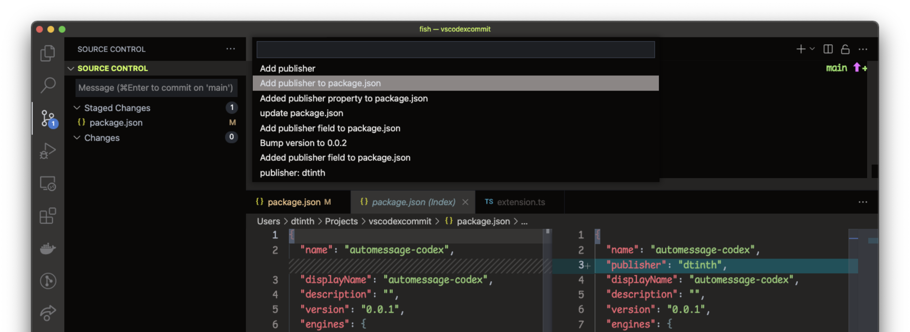
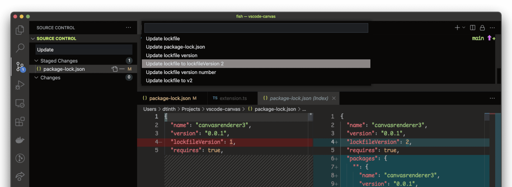

# automessage-codex

Generate a commit message using OpenAI Codex model.

If you put in some text in the commit message, it will be part of the prompt to send to OpenAI API. This increases the chance of getting a good quality commit message.

## Features

- A **Suggest Commit Message** command.

## Requirements

- You need access to the [OpenAI Codex](https://openai.com/blog/openai-codex/) model API.

## Extension Settings

This extension contributes the following settings:

- TBW

## Known Issues

- Currently prompt and parameters are hardcoded.

## Release Notes

Users appreciate release notes as you update your extension.

### 0.0.1

- Initial release.
